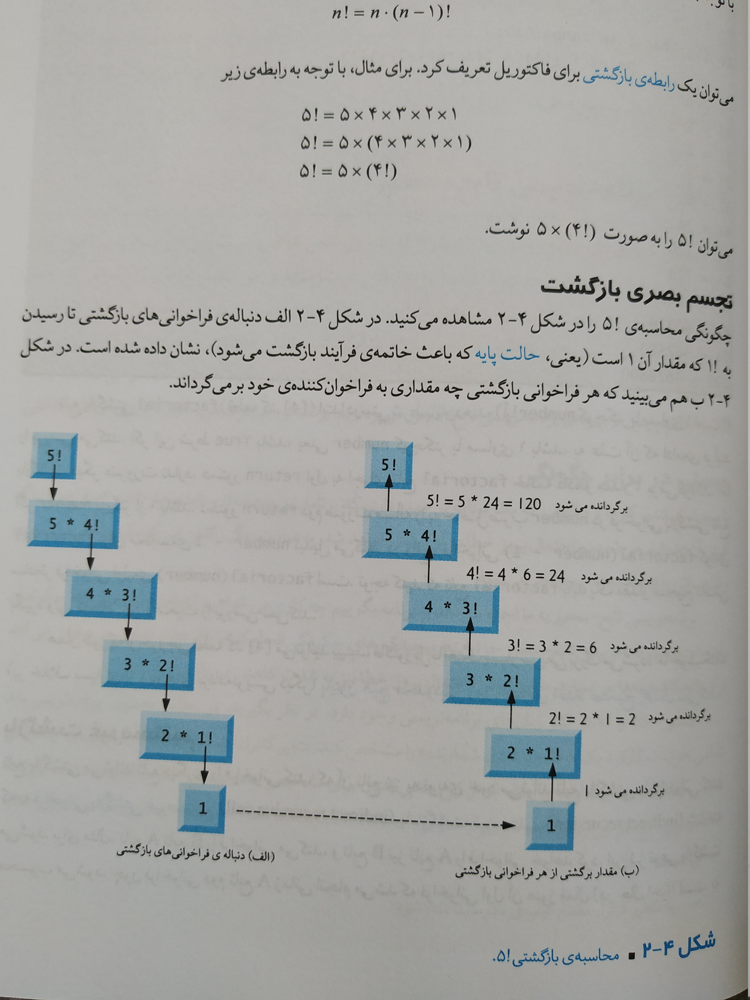
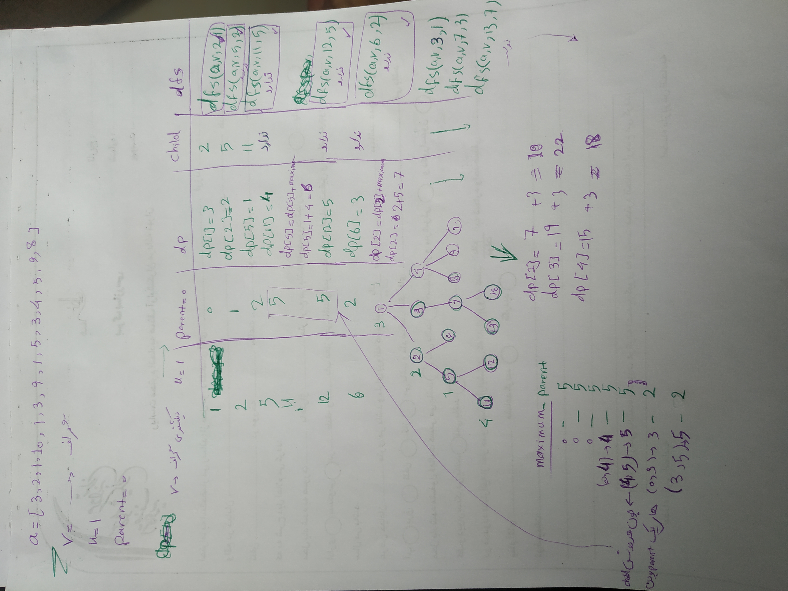

# pythonchallende_solutions

[To see the riddles click on me](http://www.pythonchallenge.com/):


# Usage
## Please install requirements
```
pip install -r  requirements.txt
```
### All python challenges are in pythonchallenge direcrotry

## How recursive works


## Dynamic programming vs Recursive difference


## The best solution in Dynamming programming is bottom up solution

## When should I solve this problem with dynamic programming?”
### We should use dynamic programming for problems that are between *tractable *and *intractable *problems.

### Tractable problems are those that can be solved in polynomial time. That’s a fancy way of saying we can solve it in a fast manner. Binary search and sorting are all fast. Intractable problems are those that run in exponential time. They’re slow. Intractable problems are those that can only be solved by bruteforcing through every single combination (NP hard).

### When we see terms like:

### “shortest/longest, minimized/maximized, least/most, fewest/greatest, “biggest/smallest

### We know it’s an optimisation problem.
### Dynamic Programming algorithms proof of correctness is usually self-evident. Other algorithmic strategies are often much harder to prove correct. Thus, more error-prone.
### When we see these kinds of terms, the problem may ask for a specific number ( “find the minimum number of edit operations”) or it may ask for a result ( “find the longest common subsequence”). The latter type of problem is harder to recognize as a dynamic programming problem. If something sounds like optimisation, Dynamic Programming can solve it.

## Fibonacci with dynamic programming in tow solution


## Solve steps of number 5 problem in pychalenge directory


# Django

## Create a djang project
```
python -m pip install django
django-admin startproject supersite (Every name you want)
cd supersite
.
├── manage.py
└── supersite
    ├── asgi.py
    ├── __init__.py
    ├── settings.py
    ├── urls.py
    └── wsgi.py

python mange.py runserver 8080
python mange.py runserver 0.0.0.0:8000

python manage.py startapp blabla


```

python manage.py startproject poll

├── db.sqlite3
├── manage.py
├── poll
│   ├── manage.py
│   └── poll
│       ├── asgi.py
│       ├── __init__.py
│       ├── settings.py
│       ├── urls.py
│       └── wsgi.py
└── supersite
    ├── asgi.py
    ├── __init__.py
    ├── __pycache__
    │   ├── __init__.cpython-38.pyc
    │   ├── settings.cpython-38.pyc
    │   ├── urls.cpython-38.pyc
    │   └── wsgi.cpython-38.pyc
    ├── settings.py
    ├── urls.py
    └── wsgi.py

4 directories, 17 files

## How django stores passwords
#### algorithm: pbkdf2_sha256 iterations: 320000 salt: VGZsDV**************** hash: QoVp11**************************************
#### By default, Django uses the PBKDF2 algorithm with a SHA256 hash, a password stretching mechanism recommended by NIST. This should be sufficient for most users: it’s quite secure, requiring massive amounts of computing time to break.
```
<algorithm>$<iterations>$<salt>$<hash>
```
### dollar-sign character and consist of: the hashing algorithm, the number of algorithm iterations (work factor), the random salt, and the resulting password hash. 
