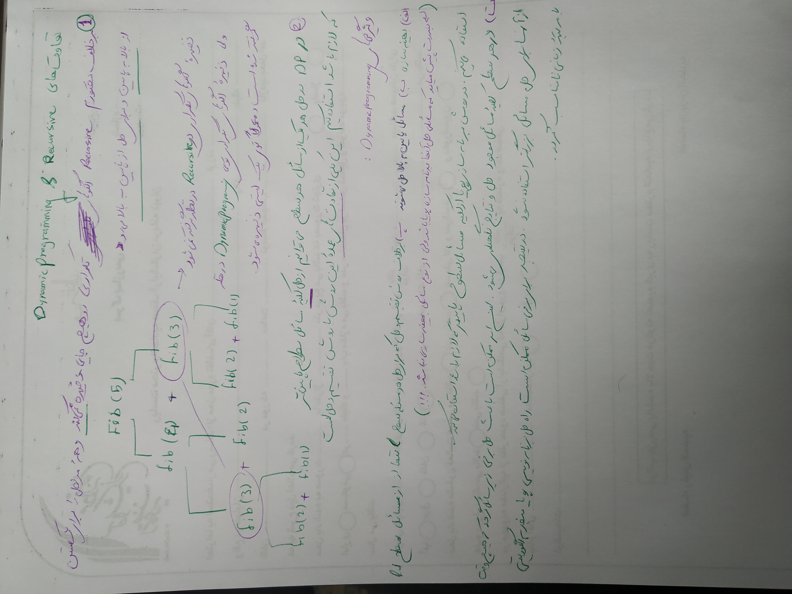
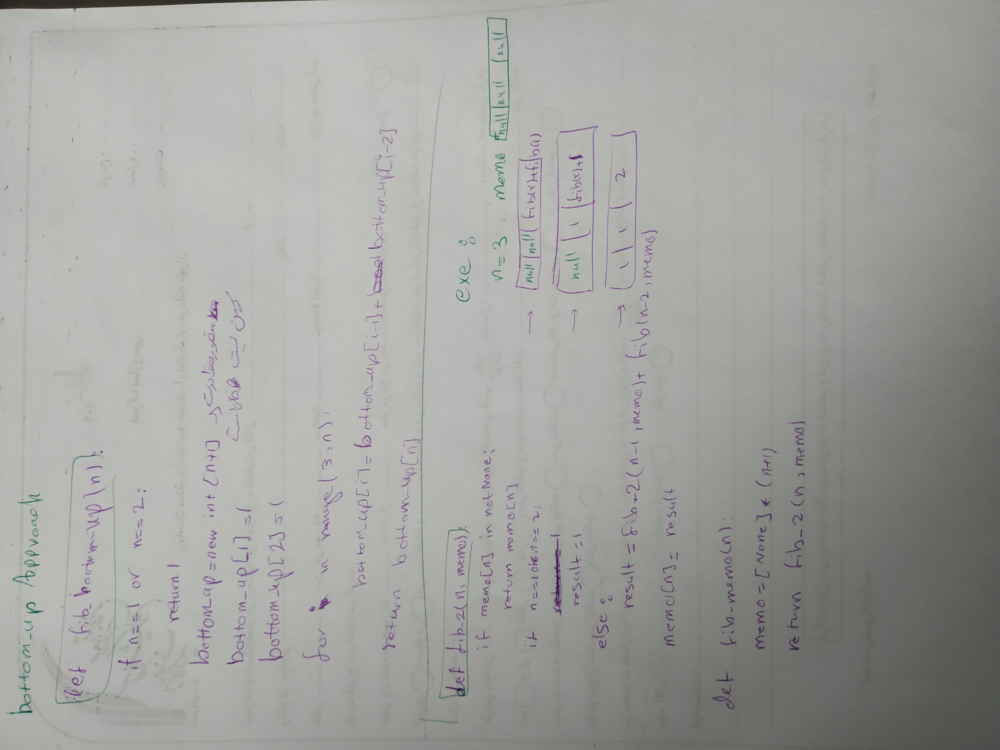

# pythonchallende_solutions

[To see the riddles click on me](http://www.pythonchallenge.com/):


# Usage
## Please install requirements
```
pip install -r  requirements.txt
```
### All python challenges are in pythonchallenge direcrotry

## How recursive works


## Dynamic programming vs Recursive difference


## The best solution in Dynamming programming is bottom up solution

## When should I solve this problem with dynamic programming?”
### We should use dynamic programming for problems that are between *tractable *and *intractable *problems.

### Tractable problems are those that can be solved in polynomial time. That’s a fancy way of saying we can solve it in a fast manner. Binary search and sorting are all fast. Intractable problems are those that run in exponential time. They’re slow. Intractable problems are those that can only be solved by bruteforcing through every single combination (NP hard).

### When we see terms like:

### “shortest/longest, minimized/maximized, least/most, fewest/greatest, “biggest/smallest

### We know it’s an optimisation problem.
### Dynamic Programming algorithms proof of correctness is usually self-evident. Other algorithmic strategies are often much harder to prove correct. Thus, more error-prone.
### When we see these kinds of terms, the problem may ask for a specific number ( “find the minimum number of edit operations”) or it may ask for a result ( “find the longest common subsequence”). The latter type of problem is harder to recognize as a dynamic programming problem. If something sounds like optimisation, Dynamic Programming can solve it.

## Fibonacci with dynamic programming in tow solution


## Solve steps of number 5 problem in pychalenge directory


# Django

## Create a djang project
```
python -m pip install django
django-admin startproject supersite (Every name you want)
cd supersite
.
├── manage.py
└── supersite
    ├── asgi.py
    ├── __init__.py
    ├── settings.py
    ├── urls.py
    └── wsgi.py

python mange.py runserver 8080
python mange.py runserver 0.0.0.0:8000

python manage.py startapp blabla


```

python manage.py startproject poll

├── db.sqlite3
├── manage.py
├── poll
│   ├── manage.py
│   └── poll
│       ├── asgi.py
│       ├── __init__.py
│       ├── settings.py
│       ├── urls.py
│       └── wsgi.py
└── supersite
    ├── asgi.py
    ├── __init__.py
    ├── __pycache__
    │   ├── __init__.cpython-38.pyc
    │   ├── settings.cpython-38.pyc
    │   ├── urls.cpython-38.pyc
    │   └── wsgi.cpython-38.pyc
    ├── settings.py
    ├── urls.py
    └── wsgi.py

4 directories, 17 files

## Django password
### How django stores passwords
#### algorithm: pbkdf2_sha256 iterations: 320000 salt: VGZsDV**************** hash: QoVp11**************************************
#### By default, Django uses the PBKDF2 algorithm with a SHA256 hash, a password stretching mechanism recommended by NIST. This should be sufficient for most users: it’s quite secure, requiring massive amounts of computing time to break.
```
<algorithm>$<iterations>$<salt>$<hash>
```
### dollar-sign character and consist of: the hashing algorithm, the number of algorithm iterations (work factor), the random salt, and the resulting password hash.

### PBKDF2
#### PBKDF2 is a simple cryptographic key derivation function, which is resistant to dictionary attacks and rainbow table attacks. 
#### It is based on iteratively deriving HMAC many times with some padding.
### PBKDF2 takes several input parameters and produces the derived key as output:
```
key = pbkdf2(password, salt, iterations-count, hash-function, derived-key-len)
```
* password – array of bytes / string, e.g. "p@$Sw0rD~3" (8-10 chars minimal length is recommended)
* salt – securely-generated random bytes, e.g. "df1f2d3f4d77ac66e9c5a6c3d8f921b6" (minimum 64 bits, 128 bits is recommended)
* iterations-count, e.g. 1024 iterations
* hash-function for calculating HMAC, e.g. SHA256
* derived-key-len for the output, e.g. 32 bytes (256 bits)

The output data is the derived key of requested length (e.g. 256 bits).

### What is a Salt?
#### A salt is a random character string that is added to the beginning or the end of a password. This salt is unique to each user, and is stored in the database along with the username and salted-hashed password.

## Django settings
#### By importing the following settings allways we have the django using settings
```
from django.conf import settings
```
## Static
#### Serving static files during development If you use django.contrib.staticfiles as explained above, runserver will do this automatically when DEBUG is set to True. If you don’t have django.contrib.staticfiles in INSTALLED_APPS, you can still manually serve static files using the django.views.static.serve() view. 
#### This is not suitable for production use! For some common deployment strategies, see How to deploy static files.
#### For example, if your STATIC_URL is defined as static/, you can do this by adding the following snippet to your urls.py:
```
from django.conf import settings
from django.conf.urls.static import static

urlpatterns = [
    # ... the rest of your URLconf goes here ...
] + static(settings.STATIC_URL, document_root=settings.STATIC_ROOT)
```
### If you set DEBUGE to False and run /admin your js, css and other static files don't run just be careful that you shuld clean fils and images caches.
### Be careful that you should create a static dir in your app and in that static dir you should create a dir with that app name

### By default, collected files receive permissions from FILE_UPLOAD_PERMISSIONS and collected directories receive permissions from FILE_UPLOAD_DIRECTORY_PERMISSIONS. If you would like different permissions for these files and/or directories, you can subclass either of the static files storage classes and specify the file_permissions_mode and/or directory_permissions_mode parameters, respectively. For example:
```
from django.contrib.staticfiles import storage

class MyStaticFilesStorage(storage.StaticFilesStorage):
    def __init__(self, *args, **kwargs):
        kwargs['file_permissions_mode'] = 0o640
        kwargs['directory_permissions_mode'] = 0o760
        super().__init__(*args, **kwargs)
```
### Then set the STATICFILES_STORAGE setting to 'path.to.MyStaticFilesStorage'.
### Use the --nostatic option to disable serving of static files with the staticfiles app entirely. This option is only available if the staticfiles app is in your project’s INSTALLED_APPS setting.
```
django-admin runserver --nostatic
```
### Use the --insecure option to force serving of static files with the staticfiles app even if the DEBUG setting is False. By using this you acknowledge the fact that it’s grossly inefficient and probably insecure. This is only intended for local development, should never be used in production and is only available if the staticfiles app is in your project’s INSTALLED_APPS setting.

--insecure doesn’t work with ManifestStaticFilesStorage.
```
django-admin runserver --insecure
```

## Whitenoise
```
STATIC_ROOT = BASE_DIR / "staticfiles"
python manage.py collectstatic
Make sure you’re using the static template tag to refer to your static files, rather than writing the URL directly. For example:


MIDDLEWARE = [
    # ...
    "django.middleware.security.SecurityMiddleware",
--> "whitenoise.middleware.WhiteNoiseMiddleware",
    # ...
]
pip install --upgrade whitenoise

```

### Serving files uploaded by a user during development
#### During development, you can serve user-uploaded media files from MEDIA_ROOT using the django.views.static.serve() view.
#### This is not suitable for production use! For some common deployment strategies, see How to deploy static files.
#### For example, if your MEDIA_URL is defined as media/, you can do this by adding the following snippet to your ROOT_URLCONF:
```
from django.conf import settings
from django.conf.urls.static import static

urlpatterns = [
    # ... the rest of your URLconf goes here ...
] + static(settings.MEDIA_URL, document_root=settings.MEDIA_ROOT)
```
### To test static_root or medias you cat use this command
```
python manage.py collectstatic
```
### This will copy all files from your static folders into the STATIC_ROOT directory.

